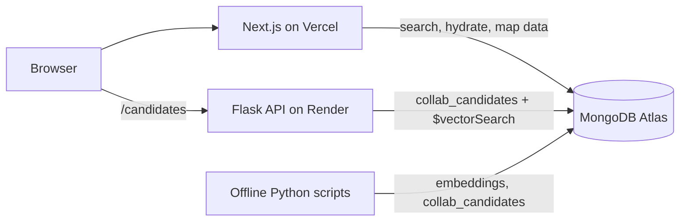

# Animore+

**Hybrid anime recommendations that combine what people watch with what shows are about.**

**Live demo:** https://animore-olive.vercel.app

> The recommendation API runs on Render's free tier, which sleeps after 15 minutes of inactivity. The first recommendation after a break can take up to a minute while it wakes up.

---

## What it does

- **Explore:** search any of ~17,000 anime (English or romaji titles) and get 50 recommendations.
- **Map:** an interactive 2D map of the catalog, where anime with similar content appear close together. Filter by genre and popularity, zoom, and hover for details.

## How recommendations work

Animore+ blends two different ideas of "similar":

| Method | Question it answers | Source |
|---|---|---|
| **Collaborative filtering** | "What did people who liked this also like?" | 5M user ratings from a MyAnimeList ratings dataset |
| **Semantic search** | "What anime have similar content?" | 384-dimensional text embeddings (Sentence Transformers) |

### 1. Collaborative filtering (offline)

`api/build_collab_candidates.py` builds a sparse **anime × user** ratings matrix, where each row describes an anime by who rated it and how highly. A cosine-distance KNN model is fit once and finds each anime's 50 nearest neighbors. Anime with fewer than 5 ratings are skipped, since their neighbors would mostly reflect noise. Results are written to MongoDB in batches as `collab_candidates`, so serving a recommendation is a single lookup instead of a model computation.

Coverage: **11,135 anime** have collaborative candidates.

### 2. Semantic search (online)

Each anime's metadata is encoded with `all-MiniLM-L6-v2` into a 384-dimensional embedding. At request time, **MongoDB Atlas Vector Search** finds the nearest embeddings by cosine similarity.

### 3. Hybrid ranking with reciprocal rank fusion

The two ranked lists are merged with **reciprocal rank fusion (RRF)**. Each anime earns `1 / (60 + rank)` points from every list it appears in, and the totals are sorted. Because points shrink slowly with rank, anime recommended by **both** methods rise to the top.

RRF uses only rank positions, not raw scores, which matters because the two methods' scores are on completely different scales.

### 4. Cold-start fallback

Titles without enough rating data (the classic **cold-start problem**) have no collaborative candidates, so they fall back to semantic search alone. Every title in the catalog gets recommendations.

### Example: Cowboy Bebop

| Rank | Collaborative | Semantic | Hybrid |
|---|---|---|---|
| 1 | Cowboy Bebop: The Movie | Cowboy Bebop: The Movie | Cowboy Bebop: The Movie |
| 2 | Samurai Champloo | Cowboy Bebop: Yoseatsume Blues | Trigun |
| 3 | Neon Genesis Evangelion | Ein's Summer Vacation | Black Lagoon: The Second Barrage |
| 4 | FLCL | Anpanman movie | Black Lagoon |
| 5 | Trigun | Gun Frontier | Samurai Champloo |

Collaborative filtering captures taste well for popular titles. Semantic search tends to surface the same franchise and some loose matches, but it's what makes recommendations possible for cold-start titles. Trigun reaches #2 in the hybrid list because both methods recommend it.

## Architecture



1. The user picks a title from autocomplete (Next.js API route, case-insensitive match on English and romaji titles).
2. The browser asks the **Flask API** for candidate IDs. It returns only MAL IDs, keeping the service small and fast.
3. Next.js **hydrates** those IDs with titles, cover art, and scores from MongoDB, then renders the cards in rank order.

## Tech stack

| Layer | Technologies |
|---|---|
| Frontend | Next.js 15 (App Router), React 19, TypeScript, Tailwind CSS, D3 |
| Recommendation API | Flask, Gunicorn |
| Database | MongoDB Atlas, Atlas Vector Search |
| ML / data | scikit-learn, SciPy, pandas, NumPy, Sentence Transformers, UMAP |
| Hosting | Vercel (frontend), Render (API) |

## API

`GET /candidates?title=<title>&mode=<mode>`

| Parameter | Values |
|---|---|
| `title` | Exact English or romaji title (case-insensitive) |
| `mode` | `hybrid` (default), `collaborative`, or `semantic` |

```json
{
  "source_id": 1,
  "candidate_ids": [5, 6, 1519, 889, 205],
  "method": "hybrid"
}
```

`GET /health` returns `{"status": "ok"}`.

## Running locally

**Prerequisites:** Python 3.10+, Node.js 18+, and a MongoDB Atlas cluster.

```bash
git clone https://github.com/deandrebailey-origin/Animore.git
cd Animore
```

**Environment variables.** Never commit these files; both are gitignored.

- `Animore/.env` (used by the Python scripts and API):
  ```
  MONGODB_URI=your_atlas_connection_string
  ```
- `Animore/ani-app/.env.local` (used by Next.js):
  ```
  MONGODB_URI=your_atlas_connection_string
  NEXT_PUBLIC_FLASK_API_URL=http://localhost:5000
  ```

**Start the API:**

```bash
cd api
pip install -r requirements-server.txt
python app.py
```

**Start the frontend** (in a second terminal):

```bash
cd ani-app
npm install
npm run dev
```

Open http://localhost:3000.

### Atlas Vector Search index

Create a Vector Search index named `vector_index` on `anime.anime_anilist`:

```json
{
  "fields": [
    { "type": "vector", "path": "embedding", "numDimensions": 384, "similarity": "cosine" }
  ]
}
```

### Rebuilding collaborative candidates

Requires the `rating_complete.csv` file from the *Anime Recommendation Database 2020* dataset on Kaggle (not included in the repo due to size):

```bash
cd api
pip install -r requirements.txt
python build_collab_candidates.py --csv rating_complete.csv --rows 5000000
```

## Known limitations and next steps

- **Franchise-heavy semantic results:** sequels and specials of the same show dominate semantic neighbors. Next step: filter same-franchise titles.
- **Equal-weight fusion:** RRF currently trusts both methods equally, letting weaker semantic matches into hybrid results. Next step: weighted fusion favoring collaborative filtering when it's available.
- **Title-heavy embeddings:** embeddings weight titles strongly, so shared words can create false matches. Next step: re-embed from synopsis, genres, and tags.
- **Map clusters:** next steps include a "taste map" built from rating data (SVD), HDBSCAN clustering, and genre coloring.

## Data sources

- Anime metadata: [AniList](https://anilist.co)
- User ratings: *Anime Recommendation Database 2020* (Kaggle), MyAnimeList ratings
